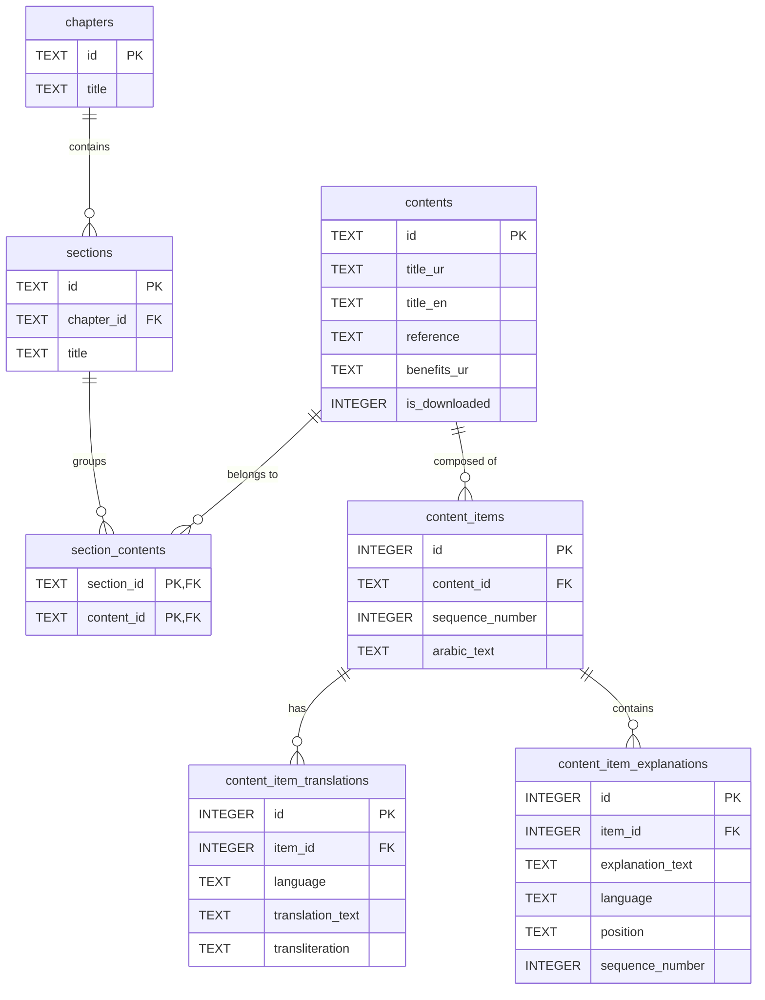

# Mafatih al-Janan Schema ERD

This folder contains the database schema model for the Mafatih al-Janan content structure.

## Database Entity Relationship Diagram (ERD)

## Schema Definitions

### `chapters`
* `id`: Unique identifier for the chapter (e.g., `chapter_1`).
* `title`: Title of the chapter (e.g., `باب اول: ادعیه`).

### `sections`
* `id`: Unique identifier for the section (e.g., `section_1_1`).
* `chapter_id`: Foreign key referencing `chapters.id`.
* `title`: Title of the section (e.g., `فصل اول`).

### `section_contents` (Junction Table)
* `section_id`: Foreign key referencing `sections.id`.
* `content_id`: Foreign key referencing `contents.id`.
* *Primary Key*: Compound key `(section_id, content_id)`.

### `contents`
* `id`: Unique identifier of the specific supplication/content (e.g., `dua_kumayl`).
* `title_ur`: Urdu title.
* `title_en`: English title.
* `reference`: Source reference citation.
* `benefits_ur`: Virtues/benefits details in Urdu.
* `is_downloaded`: Flag indicating whether the full supplication is cached/downloaded offline.

### `content_items`
* `id`: Auto-incrementing primary key.
* `content_id`: Foreign key referencing `contents.id`.
* `sequence_number`: Ordering offset of the line inside the supplication.
* `arabic_text`: The Arabic text of the line.

### `content_item_translations`
* `id`: Auto-incrementing primary key.
* `item_id`: Foreign key referencing `content_items.id`.
* `language`: Language code (e.g., `en`, `ur`).
* `translation_text`: Translated text.
* `transliteration`: Romanized pronunciation text.

### `content_item_explanations`
* `id`: Auto-incrementing primary key.
* `item_id`: Foreign key referencing `content_items.id`.
* `explanation_text`: Explicative text (e.g., instructions on actions to take).
* `language`: Language code (default `ur`).
* `position`: When to render the explanation (`before` or `after` the item).
* `sequence_number`: Position ordering.
